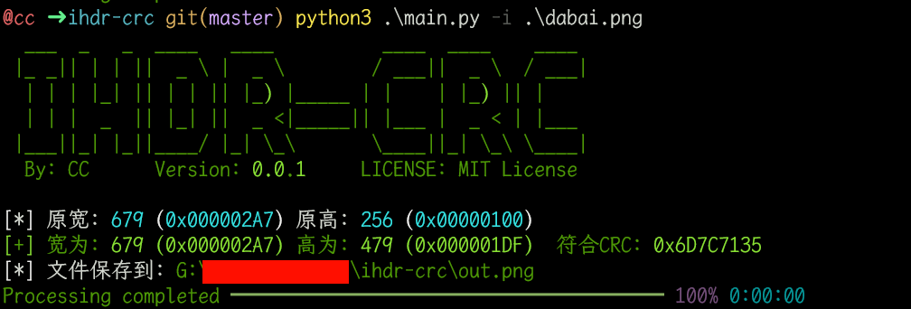
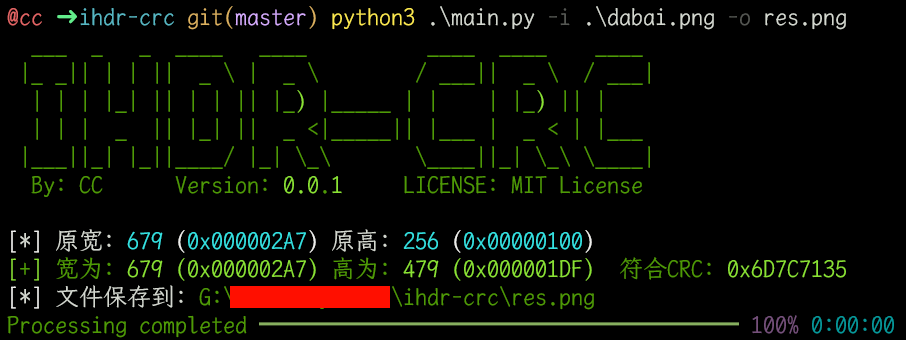

# IHDR-CRC

## 介绍

`IHDR-CRC`是对已知`IHDR`的`CRC`值爆破`png`的宽和高

## 运行环境

`python >= 3.5`

## 运行前环境

```bash
python3 -m pip install -r requirements.txt
```

## 运行命令

### 1.不指定输出路径

```bash
python3 main.py -i dabai.png
```

则会在当前目录生成`out.png`



### 2.指定输出路径

```bash
python3 main.py -i dabai.png -o res.png
```

则会在当前目录生成`res.png`


